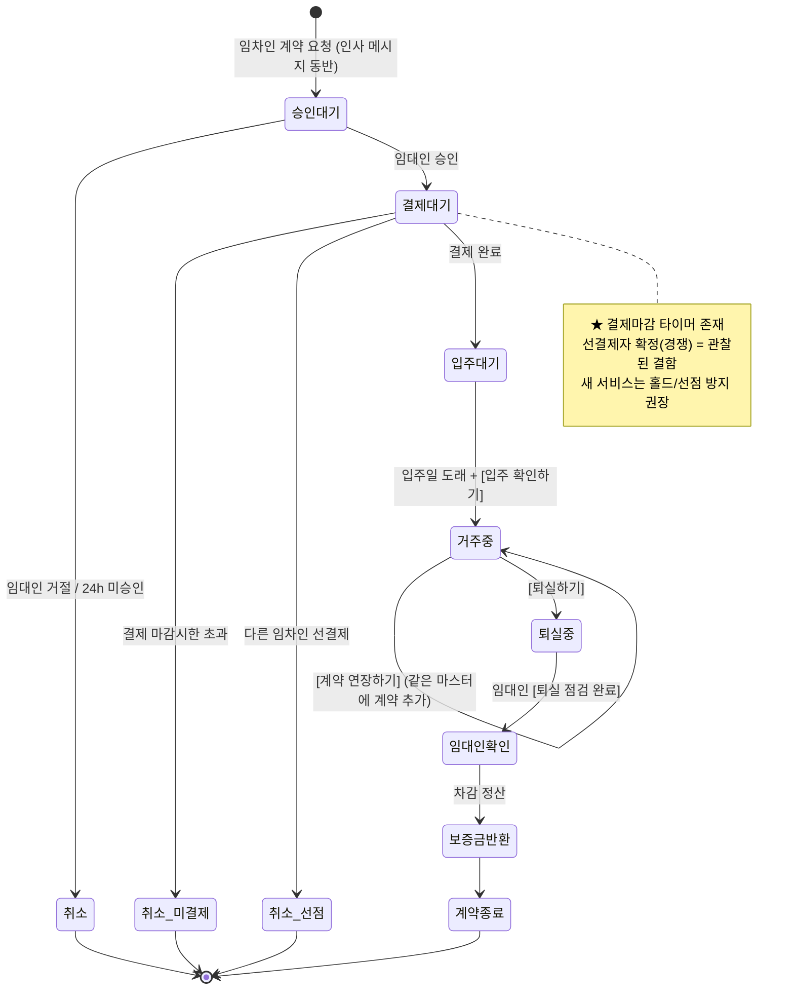
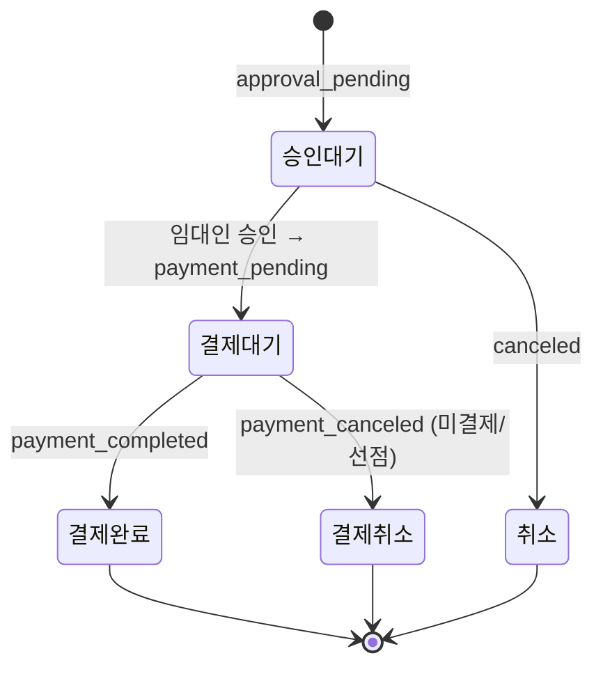
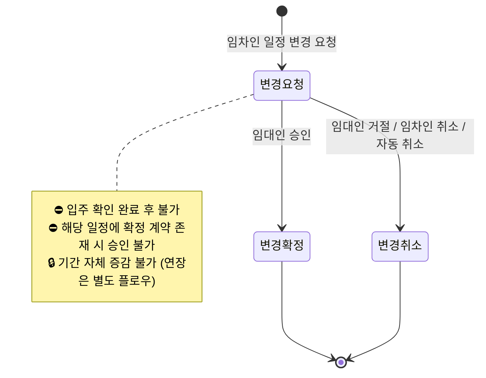
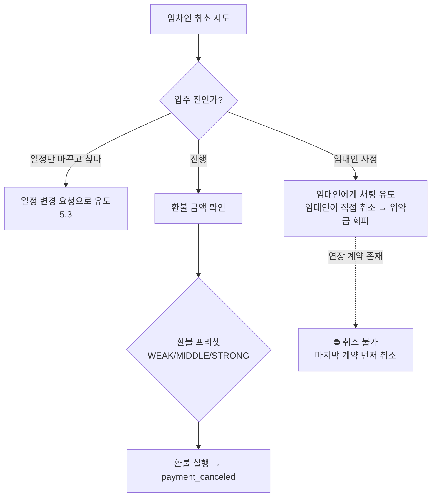
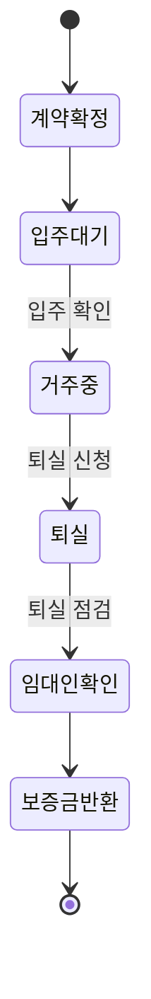
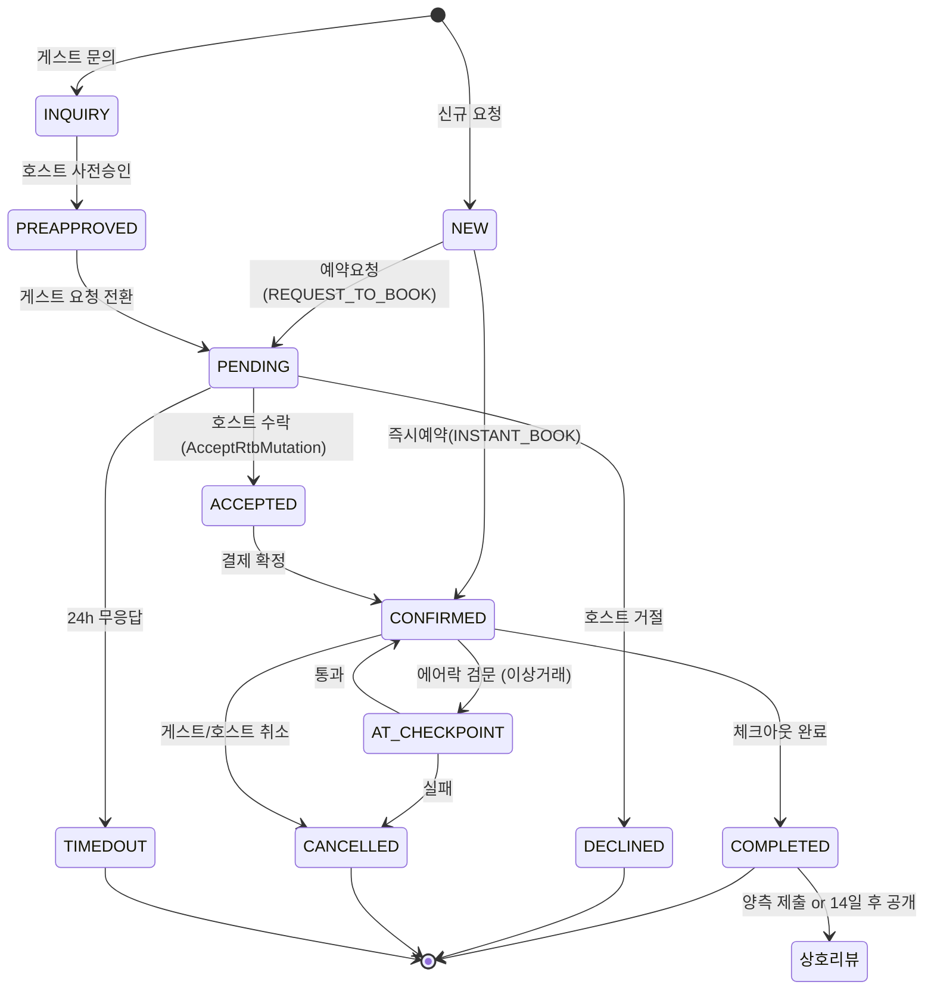
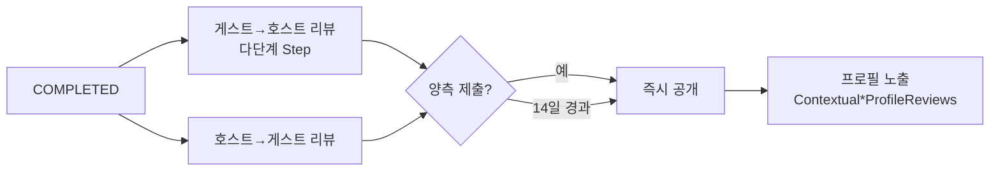

# 상태 머신 다이어그램 (Mermaid) — 33m2 · Airbnb

> 텍스트 상태도(`33m2/DOMAIN.md` §3, `airbnb/flows-and-screens.md` FLOW-A02)를 렌더 가능한 mermaid로 정규화.
> **신뢰도**: 전이 트리거·라벨은 실측(i18n 키·DOMAIN). 개별 `contractStatus` 코드값 일부는 ❓추정(§표기).
> GitHub·mermaid.live에서 렌더됨.

---

## 1. 33m2 계약 진행 축 (contract progress) ★

계약의 **생애 축**. 결제 축(§2)과 분리해서 봐야 함(DOMAIN §2.4 "상태 2축").

UI 라벨(`guest_lease_list.status.*`): `lease_pending`계약대기 · `movein_waiting`입주대기 · `staying`거주중 · `moving_out`퇴실중 · `lease_ended`계약종료 · `cancelled`취소 · `payment_cancelled`결제취소.

---

## 2. 33m2 결제 축 (payment) — 진행 축과 병행

---

## 3. 33m2 일정 변경 서브플로우 (schedule change) 🆕

`contract.tenant.schedule_change` / `landlord.respond_reschedule`. **총 계약기간 유지**(입주·퇴실일만 이동).

---

## 4. 33m2 계약 취소 결정 흐름 (cancel) — 위약금 유도 분기

> 환불률(✅검증): 15일전 무료/10%/20% · 8일전 20%/30%/50% · 1일전 40%/50%/70% · 당일이후 취소불가.

---

## 5. 입주·퇴실 타임라인 (movein_moveout 6단계)

정산 시점(✅검증): 입주일 **D+0 ~ D+2**. 보증금 330,000원 고정.

---

## 6. Airbnb 예약 라이프사이클 (ReservationStatus) ★

enum 실측(`airbnb/data-model.md` §7) + FLOW-A02. 33m2보다 상태가 세분됨(INQUIRY·PREAPPROVED·AT_CHECKPOINT).

> 33m2엔 없는 **이원 예약(즉시/요청)**과 **AT_CHECKPOINT(에어락)**이 근간. 일정변경은 `AcceptReservationAlterationMutation`으로 정식 지원.

---

## 7. Airbnb 상호 리뷰 공개 규칙 (FLOW-A03)

카테고리 평점 6종: 청결도·정확도·체크인·의사소통·위치·가격대비.

---

## 8. 새 서비스 시사점 (제안)

- **2축 분리 채택**(33m2): 진행 축 × 결제 축을 별도 컬럼으로. 클라이언트가 조합 계산하지 않고 **서버가 액션 가용성 플래그 하달**(DOMAIN §4).
- **예약 이원화 도입 검토**(Airbnb): 즉시예약/예약요청. 33m2식 승인→결제 단선보다 전환·유연성 우위.
- **선결제 경쟁 승인 제거**(33m2 결함): 결제대기 진입 시 **홀드(hold)**로 선점 방지.
- 상태값은 이 문서의 enum을 기준선으로 삼되 신규 상태(예: 정산보류)는 명세 확정 시 추가.
